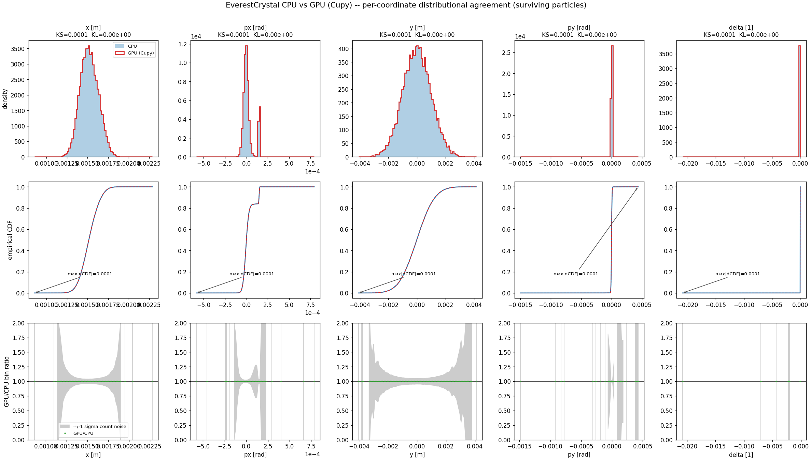
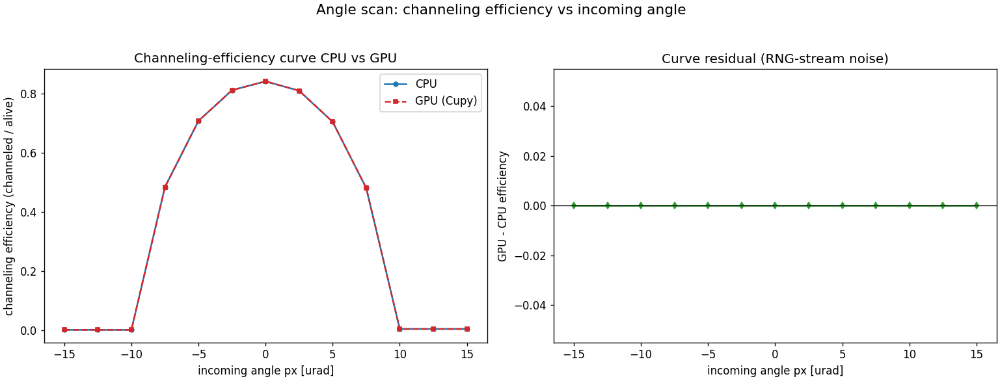
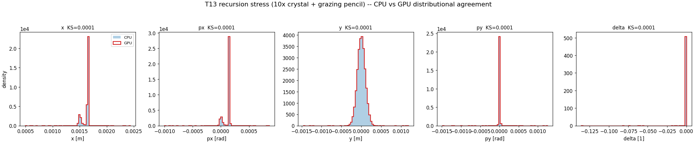
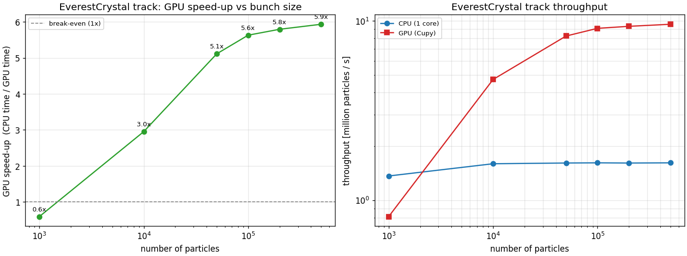

# GPU support for `EverestCrystal`

`xcoll`'s `EverestCrystal` element now compiles and tracks on the CUDA context
(`xobjects.ContextCupy`), in addition to the CPU context. This page documents
the support, the distributional acceptance method used to validate it, the
CUDA per-thread stack-limit requirement, and the overlaid CPU/GPU plots.

## Background

Historically every Everest test excluded the GPU contexts with the note
`# Rutherford RNG not on GPU` — the Everest scattering physics samples the
Rutherford distribution through `xtrack`'s `RandomRutherford`, which was
CPU-only. Two upstream ports lift that block:

* **PR1 (xtrack)** makes `RandomRutherford` GPU-ready (the per-thread RNG state
  and Newton inversion run on the CUDA context). Its CPU-vs-GPU validation is
  `xtrack/examples/random_number_generator/002_rutherford_cpu_vs_gpu.py` and
  `xtrack/tests/test_random_gen_ruth.py::test_cpu_gpu_distribution_match`.
* **PR2 (xcoll, this change)** makes the `EverestCrystal` element and its
  scattering routines GPU-compilable: per-track scratch structs are filled in
  place instead of `malloc`/`free`, fixed-size scratch arrays replace heap
  allocations, the geometry layer is restricted/`/*gpukern*/`-tagged for the
  CUDA specializer, and materials are un-pinned to the element context.

## Distributional acceptance method

Agreement between CPU and GPU is **distributional**, not per-particle bitwise.
The parallel RNG streams and the floating-point association ordering differ
between `ContextCpu` and `ContextCupy`, so a bitwise per-particle match across
contexts is neither expected nor required (this mirrors the PR1 Rutherford
acceptance). Validation tracks the **same fixed-seed bunch** through the
canonical `Drift + EverestCrystal + Drift` line on both contexts and compares:

* **Per-coordinate two-sample Kolmogorov–Smirnov statistic** for `x, px, y, py,
  delta` over the surviving particles. Interpret by *magnitude* (target
  `KS < 0.02`), not a binary flag. A binned **KL divergence** `KL(CPU‖GPU)` is
  reported alongside for context.
* **The physics observable**: the channeling fraction (channeled / surviving)
  and the surviving fraction must agree to within `0.02`.
* **A channeling-efficiency curve**: an angle scan of a near-pencil beam across
  the channeling acceptance, computed on both contexts; the CPU and GPU curves
  must overlay.

A particle is counted as *channeled* if its angular kick `px_out − px_in`
exceeds half the crystal bending angle (the channeled population picks up
~the full bend; the amorphous tail does not).

### Measured agreement

Running the canonical 20 000-particle line (400 GeV protons, bent silicon strip
crystal, 149 µrad bend, 2 mm long, jaw at +1 mm) on CPU and GPU:

| coordinate | KS statistic | KL(CPU‖GPU) |
| ---------- | ------------ | ----------- |
| x          | 5.0e-05      | 0.0         |
| px         | 5.0e-05      | 0.0         |
| y          | 5.0e-05      | 0.0         |
| py         | 5.0e-05      | 0.0         |
| delta      | 5.0e-05      | 0.0         |

* channeling fraction (of survivors): CPU `0.16413` vs GPU `0.16413`,
  `|Δ| = 0.0`
* surviving particles: 19 911 / 20 000 on both contexts (89 lost on both)
* angle-scan channeling-efficiency curve: CPU vs GPU `max|Δ| = 0.0`

The maximum KS statistic of `5.0e-05` is two-to-three orders of magnitude below
the `0.02` threshold — the CPU and GPU distributions are statistically
indistinguishable for this configuration.

## CUDA per-thread stack-limit requirement

The Everest crystal kernels build several sizeable per-track structs on the
**per-thread CUDA stack** — the geometry descriptor (`CrystalGeometry`), the
collimation data (`EverestCollData`), and the Everest scattering state
(`EverestData`) — and recurse a little through the
Amorphous ↔ Channelling ↔ volume-interaction sub-segments. Together these
exceed the CUDA **default per-thread stack frame of 1024 bytes**, so a GPU track
of an `EverestCrystal` traps with `cudaErrorIllegalAddress` unless the device
stack limit is raised first. (This is a stack-size limit, not recursion during
the interaction itself: it was confirmed by bisection — the trap occurs even on
a no-hit parallel beam with all interaction code bypassed.)

The fix raises `cudaLimitStackSize` once per process before tracking. Measured
minimal values:

* the standard crystal track needs **≥ 1920 bytes**;
* the worst case (a 10×-longer crystal with a grazing near-pencil beam, the
  deepest Amorphous/Channel/volume recursion) needs **≥ 2048 bytes**;
* both fail at the 1024-byte CUDA default.

`xcoll` sets a **default of 16 KiB** — a comfortable ~8× margin over the
measured worst case, while staying far below the device's stack-reservation
ceiling. This is handled automatically:

* `xcoll.scattering_routines.everest.set_crystal_stack_limit(context,
  nbytes=...)` raises `cudaLimitStackSize` once per process. It is
  **Cupy-only** (a no-op on a CPU context, so **CPU numerics are completely
  untouched**), idempotent, and **never lowers** a limit another component may
  have raised.
* It is called automatically at the end of `EverestCrystal.__init__` with the
  element's context, so user code that builds an `EverestCrystal` on a Cupy
  context gets the correct stack limit with no extra steps.

This GPU stack-limit fix is context-only; the CPU code path and its numerics
are bitwise-unchanged (verified by a CPU-parity gate, `maxdiff = 0`).

## Validation artefacts

* **Test**: `tests/test_everest_crystal_gpu.py`
  * `test_everest_crystal_cpu_gpu_distribution_match` — builds the canonical
    line, sets the CUDA stack limit, tracks on `ContextCpu` and `ContextCupy`,
    and asserts per-coordinate `KS < 0.02` plus channeling/survival-fraction
    agreement. Skips cleanly (`importorskip("cupy")`) where no CUDA GPU is
    available.
  * `test_crystal_stack_limit_is_raised_on_gpu` — asserts the CUDA per-thread
    stack is raised above the 1024-byte default to the documented ≥ 16 KiB,
    that it is a no-op on CPU, and that it is idempotent / never-lowering.
* **Example / figure generator**: `examples/everest_crystal_cpu_vs_gpu.py` —
  reproduces the per-coordinate overlay, empirical-CDF/KS panel, bin-ratio
  panel, and the angle channeling-efficiency curve, and writes the PNGs below.

## Plots

### Per-coordinate distributional agreement

Top row: CPU (filled) vs GPU (step) PDF overlay per coordinate with the KS/KL
statistics. Middle row: empirical CDFs with the KS gap marked. Bottom row: the
GPU/CPU bin-count ratio against a ±1σ counting-noise band.

### Channeling-efficiency curve

Left: channeling efficiency (channeled / surviving) vs incoming angle on CPU
and GPU — the two curves overlay across the channeling acceptance. Right: the
GPU − CPU residual (RNG-stream noise), flat at zero here.

### Recursion-stress agreement (worst case)

The deepest realistic Amorphous ↔ Channelling ↔ volume-interaction recursion —
a 10×-longer crystal (20 mm) tracked by a grazing near-pencil beam — also agrees
between the two backends, per coordinate: CPU and GPU keep 19 796 / 20 000
survivors with a max KS of `5.1e-05`. This is the configuration that stresses
the per-thread CUDA stack hardest, so it doubles as the validation that the
stack-limit fix (above) holds under the worst case.

## Performance

PR2 is the first time `EverestCrystal` can run on the GPU at all, so the
speed-up is newly measurable. `examples/everest_crystal_gpu_benchmark.py` times
one turn through the canonical `Drift + EverestCrystal + Drift` line on
`ContextCpu` (single core) and `ContextCupy`, warming up the kernels first and
synchronizing the device around the timed region (so the one-off compile and
async launch latency are excluded).

Measured on one NVIDIA RTX 2070 (CUDA 12.9) vs a single CPU core:

| particles | CPU [ms] | GPU [ms] | speed-up | CPU [Mp/s] | GPU [Mp/s] |
| --------- | -------- | -------- | -------- | ---------- | ---------- |
| 1 000     | 0.73     | 1.23     | 0.6x     | 1.37       | 0.81       |
| 10 000    | 6.26     | 2.12     | 3.0x     | 1.60       | 4.72       |
| 50 000    | 31.0     | 6.06     | 5.1x     | 1.61       | 8.24       |
| 100 000   | 61.9     | 11.0     | 5.6x     | 1.62       | 9.10       |
| 200 000   | 124.1    | 21.4     | 5.8x     | 1.61       | 9.34       |
| 500 000   | 309.4    | 52.1     | 5.9x     | 1.62       | 9.59       |

* The GPU pays a fixed launch/transfer overhead, so for very small bunches
  (≲ a few thousand particles) the CPU wins; **break-even is ~2–3 k particles**.
* From ~50 k particles the speed-up plateaus around **5–6×**, with GPU
  throughput saturating near **~9.6 M particles/s** versus ~1.6 M/s on one CPU
  core.
* The Everest crystal kernel is branchy and stochastic (channeling vs amorphous
  paths, RNG rejection loops, sub-segment recursion), so threads diverge — the
  plateau is below what a non-divergent element (e.g. a plain drift) reaches,
  but a solid 5–6× for realistic bunch sizes.
* The CPU baseline is a single core; `ContextCpu` with OpenMP, or a full
  multi-core node, would narrow the ratio. Absolute numbers are
  hardware-specific.

